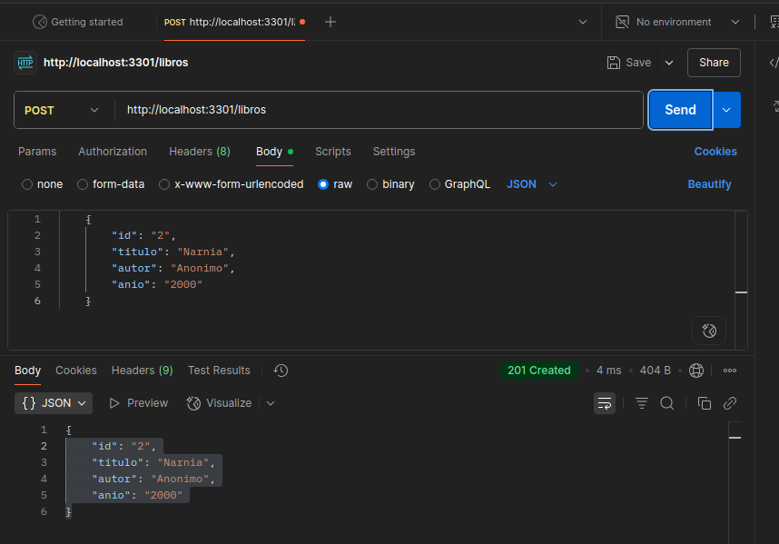

## Agregar json-server a un proyecto para usar API

### Opcion 1:
1. Pararnos en la carpeta del proyecto.
2. Escribir el siguiente comando:
        npm install json-server        // Windows
        npm install -g json-server    // linux
3. Crear un archivo llamado:
        db.json
4. Escribir el siguiente comando:
        json-server db.json
5. Clickear en:
        Index:
        http://locallhost:3000/
    para que se abra en el navegador.
6. Creamos una nueva carpeta llamada:
        public
7. Creamos un index.html    (New-Item index.html en W11 por terminal)
8. Importamos tanto el 'link' como el 'script' de bootstrap en el html
9. buscamos una tabla:
        https://getbootstrap.com/docs/5.3/content/tables/
10. 

fuente: https://www.youtube.com/watch?v=PfwQsKbUqYA&ab_channel=GerardMayans

---
### Opcion 2
1. Crear carpeta del proyecto:
* mkdir eventos-json-server
* cd evento-json-server
* code .
2. Iniciar el proyecto con Node.js
* npm init -y
3. Instalar json-server:
* npm install json-server
4. Crear un archivo db.json:

{
"users": [
        {
        "id": 1,
        "nombre": "diego",
        "fecha": "2025-06-30"
        }
  ]
}

5. Agregar el siguiente script en package.json:

"scripts": {
        "server": "json-server --watch db.json --port 3301"
}

6. Iniciar el servidor:
* npm run server

7. La url la copiamos y pegamos en el postman:
http://localhost:3301/user

---
### POSTMAN
url api = http://localhost:3301/libros

#### GET (Read - Leer):
1. Pegamos la url generada en el json-server.
2. Fijarnos que esté en GET - Body - raw - JSON.
3. Click en send.
4. Fijarnos que de respuesta de 200.

#### POST (Create - Crear):
1. Pegamos la url generada en el json-server.
2. Fijarnos que esté en POST - Body - raw - JSON.
3. Copiamos, pegamos y modificamos la misma estructura del anterior JSON:
    {
        "id": "2",
        "titulo": "Narnia",
        "autor": "Anonimo",
        "anio": "2000"
    }
3. Click en send.
4. Fijarnos que de respuesta de 200.

#### PUT (Update - Actualizar):
1. Pegamos la url generada en el json-server, pero agregándole "/id" al final:

url api = http://localhost:3301/libros/2

2. Fijarnos que esté en PUT - Body - raw - JSON.

3. Pegamos el objeto y sus datos a modificar el id 2:

    {
        "id": "2",
        "titulo": "Narnia y El Principe Caspian",
        "autor": "C.S. Lewis",
        "anio": "1951"
    }

3. Copiamos, pegamos y modificamos la misma estructura del anterior JSON:
    {
        "id": "2",
        "titulo": "Narnia",
        "autor": "Anonimo",
        "anio": "2000"
    }

3. Click en send.
4. Fijarnos que de respuesta de 200.

#### DELETE (Delete - Borrar):
1. Pegamos la url generada en el json-server, pero agregándole "/id" al final:

url api = http://localhost:3301/libros/1

2. Fijarnos que esté en DELETE (tener cuidado porque vamos a eliminar el '/id' indicado)
3. Click en send.
4. Fijarnos que de respuesta de 200.
